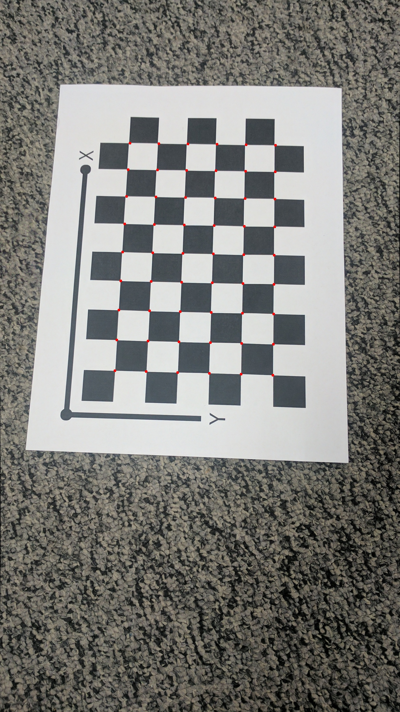
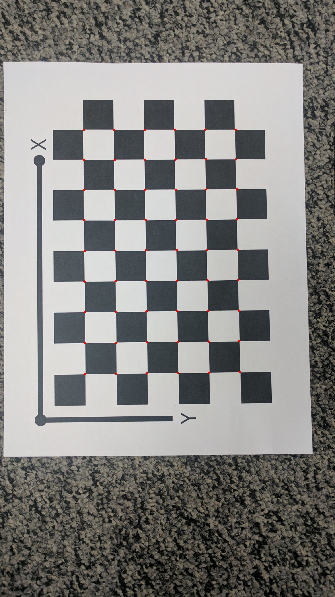
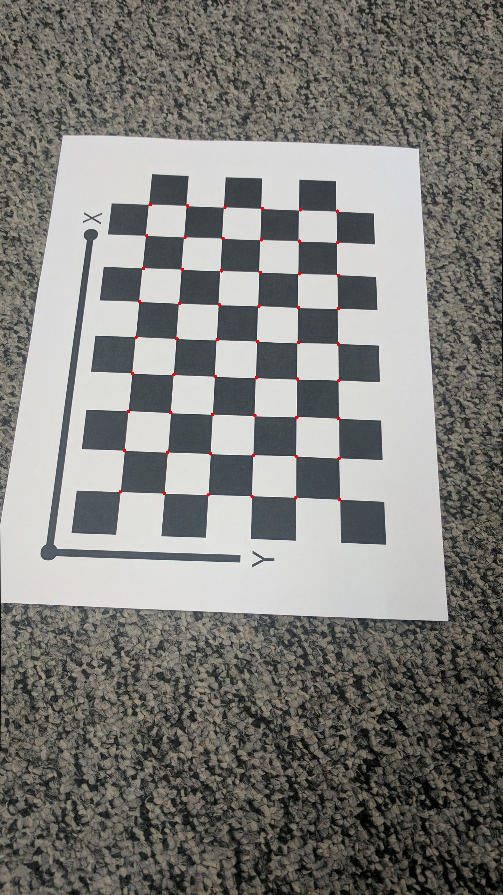

# AutoCalib - Camera Calibration from Scratch

A complete implementation of camera calibration using a checkerboard pattern, implemented entirely from scratch using NumPy, OpenCV, and SciPy. This project demonstrates the mathematical foundations of camera calibration without relying on OpenCV's built-in calibration functions.

## 📋 Table of Contents

- [Overview](#overview)
- [Features](#features)
- [Algorithm](#algorithm)
- [Requirements](#requirements)
- [Installation](#installation)
- [Usage](#usage)
- [Results](#results)
- [Technical Details](#technical-details)
- [Project Structure](#project-structure)
- [License](#license)

## 🎯 Overview

AutoCalib performs camera intrinsic calibration by:
1. Detecting checkerboard corners in multiple calibration images
2. Computing homographies between the checkerboard plane and image plane
3. Estimating the camera intrinsic matrix using Zhang's method
4. Extracting rotation and translation matrices for each view
5. Optimizing camera parameters using Levenberg-Marquardt optimization
6. Visualizing reprojection accuracy on undistorted images

The calibration process estimates:
- **Camera Intrinsic Matrix (K)**: Focal lengths, principal point, and skew
- **Distortion Coefficients (k₁, k₂)**: Radial distortion parameters
- **Extrinsic Parameters**: Rotation and translation for each calibration image

## ✨ Features

- ✅ **Pure NumPy Implementation**: Core algorithms implemented from scratch
- ✅ **Zhang's Calibration Method**: Industry-standard calibration algorithm
- ✅ **Non-linear Optimization**: Levenberg-Marquardt optimization for parameter refinement
- ✅ **Radial Distortion Correction**: Models and corrects lens distortion
- ✅ **Visual Validation**: Generates images showing reprojected points
- ✅ **Sub-pixel Corner Detection**: Uses OpenCV's cornerSubPix for accurate corner detection

## 🔬 Algorithm

The calibration process follows these steps:

### 1. Corner Detection
- Detects checkerboard corners using `cv2.findChessboardCorners`
- Refines corners to sub-pixel accuracy using `cv2.cornerSubPix`
- Creates 3D object points from the known checkerboard dimensions

### 2. Homography Estimation
- Computes homography matrices between the checkerboard plane and each image
- Uses SVD (Singular Value Decomposition) to solve the homography equations
- Each homography relates the 3D checkerboard coordinates to 2D image coordinates

### 3. Initial Camera Matrix Estimation
- Applies Zhang's method using the constraints from multiple homographies
- Solves a system of equations derived from the orthogonality constraints
- Estimates initial values for focal lengths (α, β), principal point (u₀, v₀), and skew (γ)

### 4. Extrinsic Parameter Extraction
- Decomposes each homography to extract rotation and translation
- Ensures orthonormality of rotation vectors
- Computes the third rotation vector using cross product

### 5. Non-linear Optimization
- Optimizes camera parameters using `scipy.optimize.least_squares`
- Minimizes reprojection error across all calibration images
- Refines intrinsic parameters and distortion coefficients

### 6. Reprojection and Visualization
- Projects 3D points back to image space using optimized parameters
- Applies radial distortion correction
- Visualizes reprojected points on undistorted images

## 📦 Requirements

- Python 3.6+
- NumPy
- OpenCV (cv2)
- SciPy

## 🚀 Installation

```bash
# Clone the repository
git clone <repository-url>
cd AutoCalib

# Install dependencies
pip install numpy opencv-python scipy
```

## 💻 Usage

1. **Prepare Calibration Images**: Place your checkerboard calibration images in the `Calibration_Imgs/` directory. The images should show the checkerboard from different angles and positions.

2. **Configure Parameters**: Edit `Wrapper.py` to set:
   - `rows`: Number of inner corners in the checkerboard (rows)
   - `cols`: Number of inner corners in the checkerboard (columns)
   - `square_size`: Physical size of each square in millimeters

   ```python
   rows = 9      # Inner corners: 9 rows
   cols = 6      # Inner corners: 6 columns
   square_size = 21.5  # Size in mm
   ```

3. **Run Calibration**:
   ```bash
   python Wrapper.py
   ```

4. **View Results**: 
   - Calibration parameters are printed to the console
   - Reprojected images are saved in the `Results/` directory
   - Red circles indicate where the checkerboard corners should be after calibration

## 📊 Results

The calibration process outputs:

### Console Output
```
Average error before optimization: <initial_error>
Final K: [[fx, s, cx], [0, fy, cy], [0, 0, 1]]
Final k: [k1, k2]
Average error after optimization: <final_error>
```

### Visual Results

The script generates images showing the reprojected points (red circles) overlaid on the undistorted calibration images:


*Reprojected corners on undistorted image 0*


*Reprojected corners on undistorted image 5*


*Reprojected corners on undistorted image 1*

The red circles indicate where the checkerboard corners are projected based on the calibrated camera model. Smaller reprojection errors indicate better calibration accuracy.

## 🔧 Technical Details

### Camera Model

The pinhole camera model with radial distortion is used:

**Projection:**
```
[u]   [fx  s  cx] [X]
[v] = [0  fy  cy] [Y]
[1]   [0   0   1] [Z]
```

**Radial Distortion:**
```
x_distorted = x * (1 + k₁r² + k₂r⁴)
y_distorted = y * (1 + k₁r² + k₂r⁴)
where r² = x² + y²
```

### Key Functions

- **`get_corners()`**: Detects and refines checkerboard corners
- **`find_Homography()`**: Computes homography using SVD
- **`get_camera_matrix()`**: Estimates initial camera intrinsics using Zhang's method
- **`get_R_t()`**: Extracts rotation and translation from homographies
- **`get_projected_points()`**: Projects 3D points to 2D with distortion
- **`get_geometric_error()`**: Objective function for optimization

### Calibration Images

The project includes 13 calibration images showing a checkerboard pattern from various viewpoints:


*Example calibration image with checkerboard pattern*

## 📁 Project Structure

```
AutoCalib/
│
├── Wrapper.py              # Main calibration script
├── Calibration_Imgs/       # Input calibration images
│   ├── IMG_20170209_042606.jpg
│   ├── IMG_20170209_042608.jpg
│   └── ...
├── Results/                # Output images with reprojected points
│   ├── Reprojected_0.jpg
│   ├── Reprojected_1.jpg
│   └── ...
├── checkerboardPattern.pdf # Checkerboard pattern reference
├── LICENSE                 # License file
└── README.md              # This file
```

## 🎓 Educational Value

This implementation is particularly useful for:
- Understanding the mathematical foundations of camera calibration
- Learning Zhang's calibration method
- Seeing how optimization improves calibration accuracy
- Visualizing the effects of distortion correction

## 📝 License

See the [LICENSE](LICENSE) file for details.

## 🙏 Acknowledgments

- Based on Zhang's camera calibration method (1999)
- Uses OpenCV for corner detection and image processing
- SciPy for non-linear optimization

---

**Note**: This is a from-scratch implementation for educational purposes. For production use, consider using OpenCV's `cv2.calibrateCamera()` which includes additional optimizations and robustness features.
